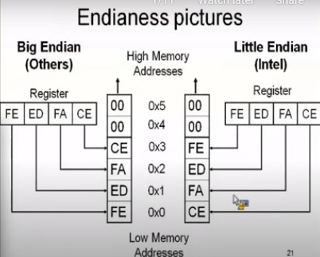
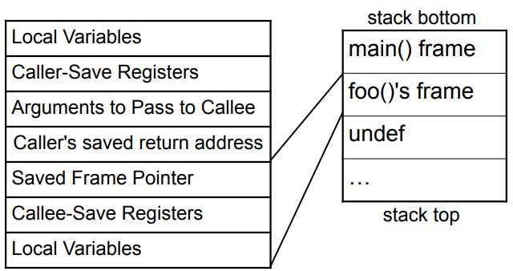
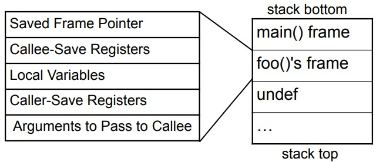

* decimal, hexadecimal and binary numbers.

* Negative numbers
    * 1's compliment -> flip the bits of binary numbers
    * 2's compliment -> 1's compliment + 1

* CISC vs RISC
    * CISC Complex instruction set computer
        * variable length instructions: length of instructions vary from 1 to 16
        * over time, if it was found that compiler is using sequence of instructions frequently, it was merged in one new instruction for optimization.
        * example : Intel
    * RISC Reduced instruction set computer
        * fixed length instruction
        * optimization is done by pipelining
        * example: ARM, PowerPC, MIPS, SPARC

* Endianess
    * Intel is little-endian, all others are big-endian
    * network data is also big-endian
    * 

* Intel Registers and associated conventions: use registers for operations
    * General purpose:
        * EAX (AX, AL, AH) - function return values
        * EBX (BX, BL, BH) - Base Pointer (of data section)
        * ECX (CX, CL, CH) - Counter (strings and loop)
        * EDX (DX, DL, DH) - Data I/O pointer

        * ESI (SI) - source pointers (for strings)
        * EDI (DI) - destination pointers (for strings)
    
    * Special purpose:
        * ESP (SP) - Stack pointer (top of stack)
        * EBP (BP) - Base of stack frame
        * EIP (IP)   - instruction pointer (pointer to next instruction)
        * EFLAGS(FLAGS) -  flags are updated after every instruction

    * Caller-save register: EAX, ECX, EDX
        * Caller is responsible to save these registers on stack before calling function.
        * callee can (and likely will) overwrite these registers.

    * Callee-save register: EBX, EBP, ESI, EDI
        * if callee wants to use these register, it is supposed to save them before use & restore before returning result in EAX

    * Stack: area in main memory (RAM)
        * stack grows to lower addresses while other segments grow to higher addresses
        * **Q: Not sure if it is true only for intel or all CPUs?**
        * stores local variables, arguments and register contents

    * Calling Conventions - what happens during calling of a function
        * caller and callee must use same calling convention or function call will be messed up.
        * cdecl and stdcall - types of calling convention
        * cdecl - most common calling convention
        * stdcall - used by microsoft C++ win32 APIs
        * In Visual studio if you define function : void __stdcall f() { } : it says that this function follows stdcall calling convention.

    * Stack frame operations during function call:
        * In calling function
            * Push Caller-save registers: EAX, ECX, EDX on stack
            * Push parameters on stack  RIGHT->LEFT
            * execute CALL
                * Push return address (contents of IP) to stack
                * load IP with address given in argument.
        * In called function
            * load EBP on stack.    # push    rbp
            * load ESP in EBP.      # mov     rbp, rsp
            * Save Callee-save registers: EBX, EBP, ESI, EDI on stack
        * components of a stack frame
        

    * Stack frame operations during function RETURN :
        * Before returning: 
            * load return value in EAX (if it 32 bit) or EDX:EAX(if it 64 bit)
            * de-allocate local variables.
            * pop and restore contents of Callee-save registers.
            * pop and load contents of ESP in EBP.  # pop     rbp
        * During and after Return:    
            * cdecl: execute RET(pop and load contents of SP to IP) then, de-allocate arguments
            * stdcall: de-allocate arguments then, execute RET(pop and load contents of SP to IP) 
            * pop and restore contents of Caller-save registers.                     

    * stack frame are implemented as Linked list - Node looks like this
        